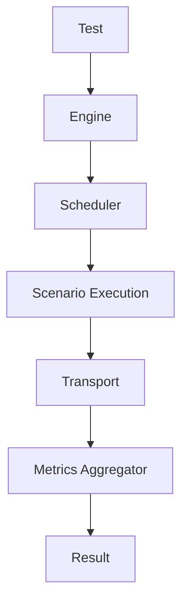

# Pulse

**Pulse** is a programmable reliability and load testing engine written in Go.

It allows developers to define load tests directly in Go code, execute them with a deterministic engine, and analyze system behavior under controlled stress conditions.

Unlike traditional tools that rely on external configuration languages (YAML/JS), Pulse follows a **code-first approach**, enabling full use of Go's type system, tooling, and testing ecosystem.

---

## Vision

Pulse is designed to evolve beyond a simple load generator into a **platform for reliability experimentation**.

The long-term goal is to provide a programmable environment where engineers can:

- Generate controlled system load
- Experiment with failure scenarios
- Analyze latency behavior under stress
- Explore system resilience under degraded conditions

The initial version focuses on building a **deterministic, extensible execution engine**.

---

## Features (MVP)

Current goals for the initial version include:

- Deterministic load generation
- Arrival-rate based scheduling
- Programmable scenarios using Go
- Built-in metrics aggregation
- Latency percentiles (p50, p95, p99)
- JSON result output
- CLI execution

Future capabilities may include:

- Fault injection (latency, errors)
- Chaos experimentation modules
- Additional transports (gRPC, TCP)
- Observability integrations
- Distributed execution

---

## Example

```go
package main

import (
	"context"
	"time"

	"github.com/jmgo38/pulse"
)

func main() {
	test := pulse.Test{
		Phases: []pulse.Phase{
			pulse.ConstantRate(100, 10*time.Second),
		},
		Scenario: func(ctx context.Context) error {
			// Example request
			// http.Get("https://api.example.com")
			return nil
		},
	}

	result, err := pulse.Run(test)
	if err != nil {
		panic(err)
	}

	println("Total Requests:", result.TotalRequests)
	println("Errors:", result.TotalErrors)
}
```

---

## Architecture Overview

Pulse is structured around a small set of core components:



---

## Core Concepts

| Component | Responsibility                                          |
| --------- | ------------------------------------------------------- |
| Engine    | Orchestrates test lifecycle                             |
| Scheduler | Generates execution events based on arrival rate        |
| Scenario  | Defines the behavior executed by each virtual execution |
| Transport | Executes external operations (HTTP in MVP)              |
| Metrics   | Aggregates latency and error statistics                 |

---

## Project Structure

```
pulse/
├── cmd/pulse/        # CLI entry point
├── engine/           # Test lifecycle orchestration
├── scheduler/        # Arrival-rate scheduling
├── metrics/          # Metrics aggregation and percentiles
├── scenario/         # Scenario definitions
├── transport/        # HTTP transport implementation
├── internal/         # Internal utilities (clock, concurrency, token bucket)
├── pulse.go          # Public API (Test, Run, Result)
├── go.mod
└── README.md
```

---

## Design Principles

Pulse is built around the following principles:

**Code-first configuration**

Tests are defined in Go, allowing:
- type safety
- IDE support
- composability
- integration with Go tests

**Deterministic execution**

The engine aims to produce statistically consistent results when executed under similar conditions.

**Explicit concurrency model**

Concurrency is controlled through bounded goroutines and a scheduler-driven execution model.

**Minimal dependencies**

Pulse is designed to remain lightweight and easy to embed.

---

## Status

Pulse is currently under active development.

APIs may change during early versions as the core architecture stabilizes.

---

## Contributing

Contributions are welcome.

If you have ideas for improvements, experiments, or transports, feel free to open an issue or submit a pull request.

---

## License

MIT License
